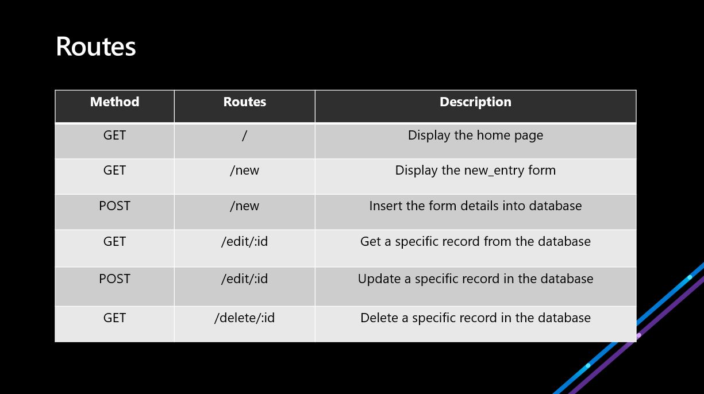

## Building Backend Applications using Node.js & MongoDB

## Starter Kit
Find all the prerequisite setups <a href="https://docs.google.com/document/d/1Vb8ZTe55spV8R8cXcsZVEGSzok3S87N2EYLhrIsD02c/edit?usp=sharing">here</a>

## CRUD Application Routes


## Installation

- Clone the repository and navigate into the respective folder

- Install the required npm packages : 
`npm install` 

- For the "CRUD Application" you'll need to create a MongoDB URI connection. Then in app.js line 14 replace "YOUR_MONGODB_URI" with your own MongoDB URI. For example,
  ```
  mongodb+srv://<username>:<password>@cluster0.n0t8d.mongodb.net/myFirstDatabase?retryWrites=true&w=majority
  ```
